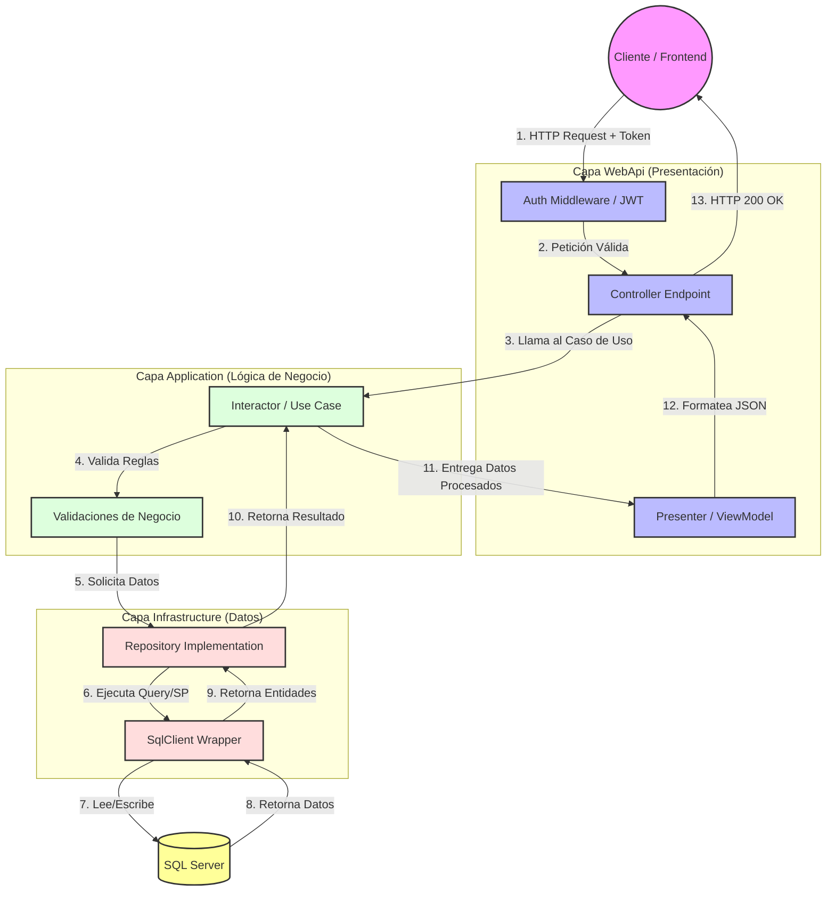
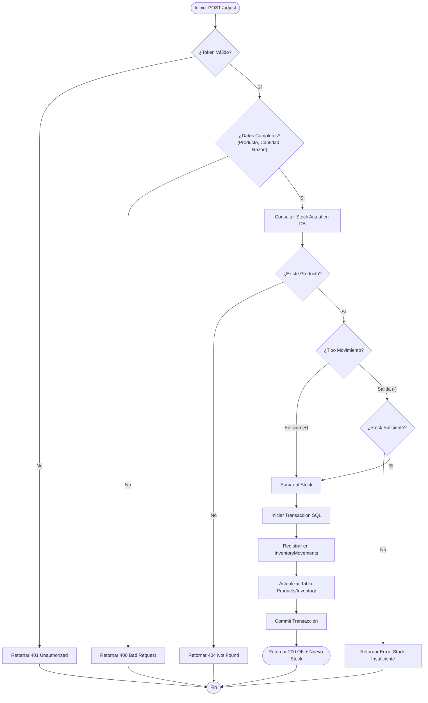
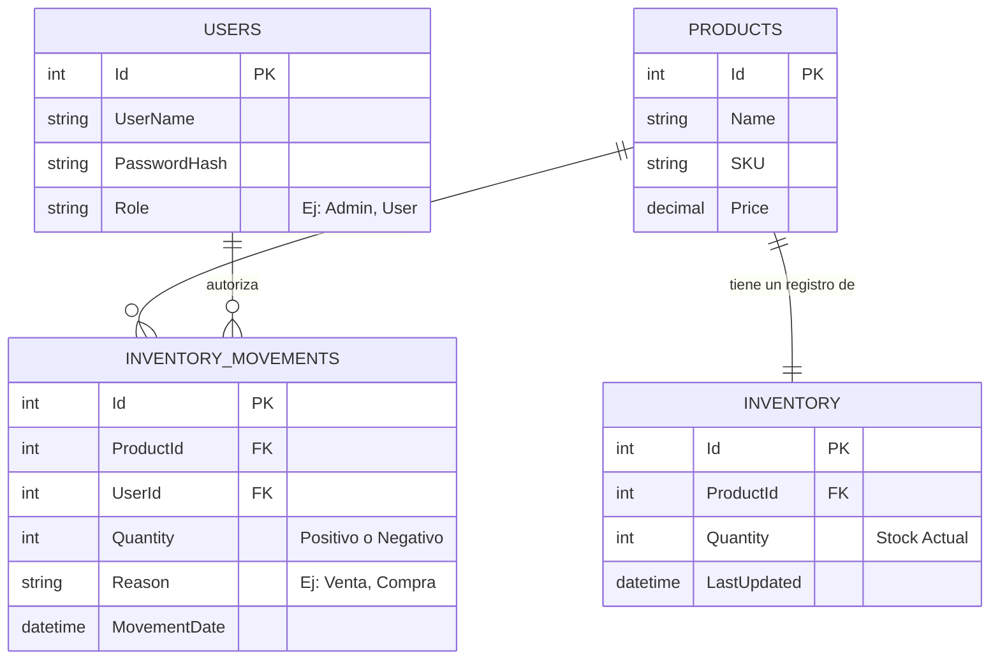
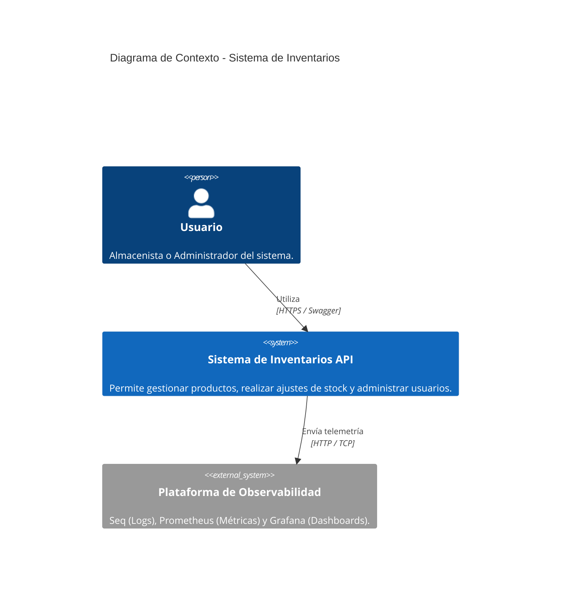
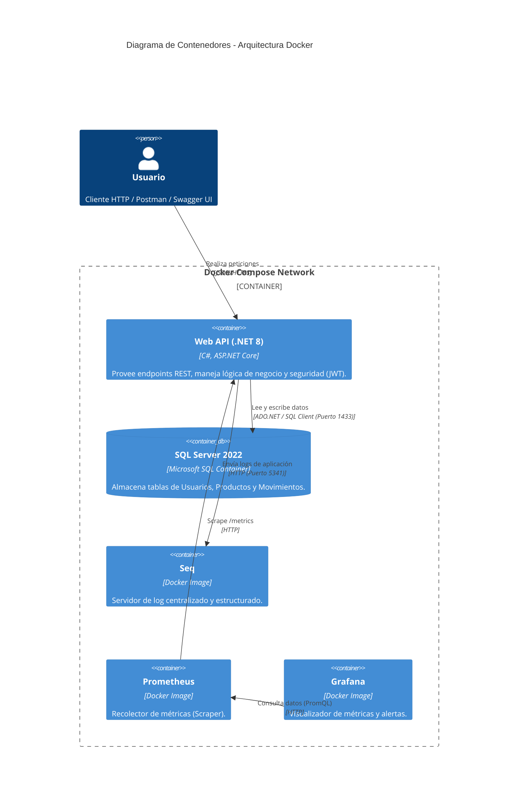
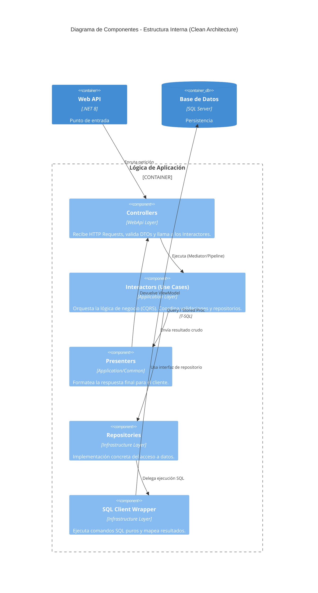
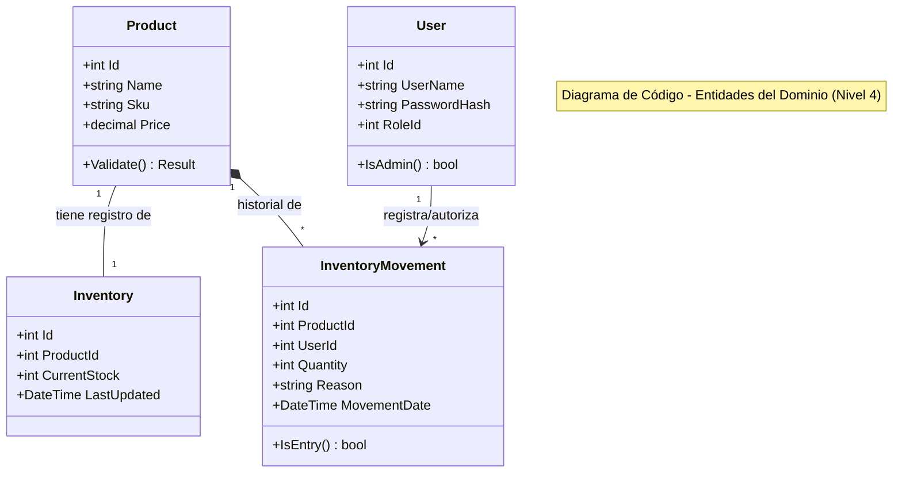

# 1. Diagrama de Flujo de Arquitectura (Nivel Alto)
Este diagrama muestra cómo viaja una petición (Request) desde que el usuario la hace hasta que llega a la base de datos y regresa.

# 2. Diagrama de Flujo del Proceso "Ajuste de Inventario"
Este diagrama detalla la lógica específica del endpoint más importante (/api/Inventory/adjust), mostrando las decisiones que toma el código.

# 3. Diagrama Entidad-Relación (Base de Datos)
Este diagrama modela la estructura física de tu base de datos SQL Server, mostrando las tablas principales (Users, Products, Inventory) y cómo se relacionan a través de claves foráneas (FK) en el historial de movimientos (InventoryMovements).

# Diagramas de Arquitectura C4
El modelo C4 (Context, Containers, Components, Code) es el estándar de la industria para documentar arquitectura de software. Es ideal para tu manual técnico porque va desde lo general (Contexto) hasta lo específico (Código).

Basado en la estructura de tu repositorio (.NET 8, Docker, Clean Architecture), he diseñado los tres niveles más importantes para tu documentación.

Puedes copiar estos códigos en [Mermaid Live Editor](https://mermaid.live/) para generar las imágenes en alta calidad.

## Nivel 1: Diagrama de Contexto (System Context)
Vista de "gran altura". Muestra quién usa el sistema y con qué otros sistemas externos interactúa.

Nivel 2: Diagrama de Contenedores (Containers)
Vista de "infraestructura". Muestra cómo se despliega el software utilizando Docker. Este es vital para tu proyecto dado que usas docker-compose.

Nivel 3: Diagrama de Componentes (Components)
Vista de "código". Muestra cómo está organizada tu API internamente, respetando tu estructura de carpetas (CleanArch, Infra, WebApi).

Nivel 4: Diagrama de Código (Code / Class Diagram)
Vista de "microscopio". Muestra las clases del Dominio, sus atributos y relaciones directas. Es útil para que los desarrolladores entiendan las entidades principales sin leer todo el código.
